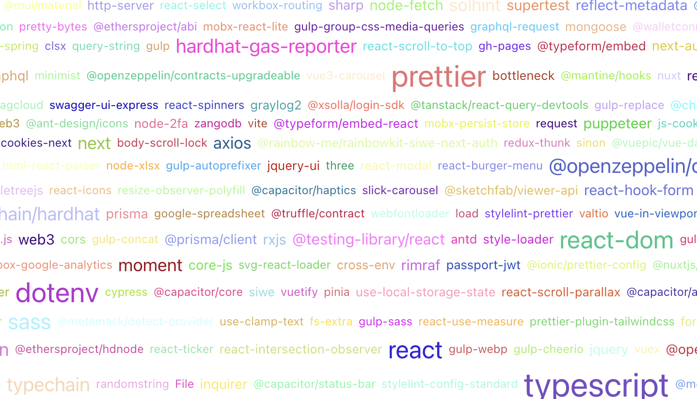

# ♻️ Loonshots dev dependencies wordcloud

This React project showcases a wordcloud of dependencies and technologies used in previous `Loonshots` projects. The wordcloud is generated from `Dependencies` and `devDependencies` sections of `package.json` files extracted from our `GitLab` repositories.
## Available Scripts

In the project directory, you can run:

### `npm i`

### `npm start`

Runs the app in the development mode.\
Open [http://localhost:3000](http://localhost:3000) to view it in your browser.

### Package.json parser here `collect-dependencies.js`
### Result dependencies here `src/dependency-counts.json`

